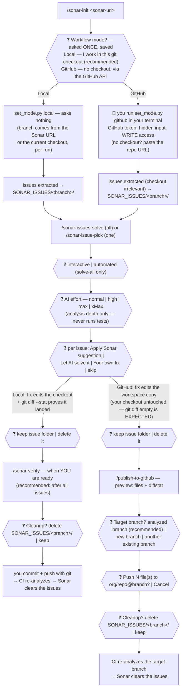
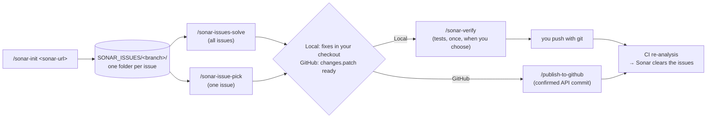
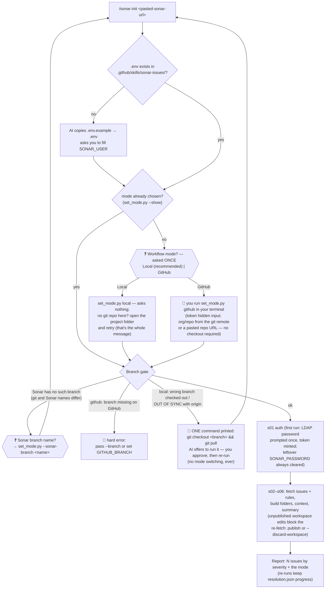
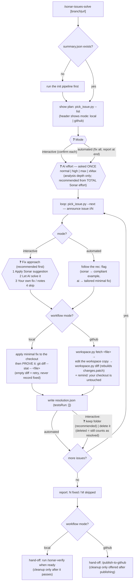
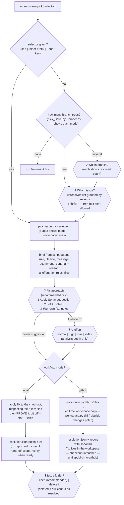
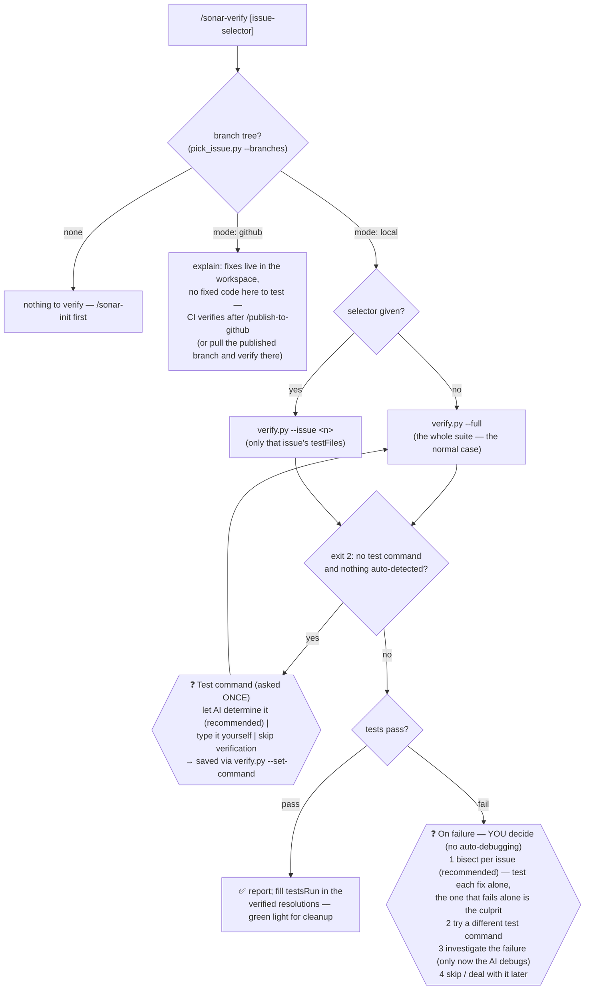
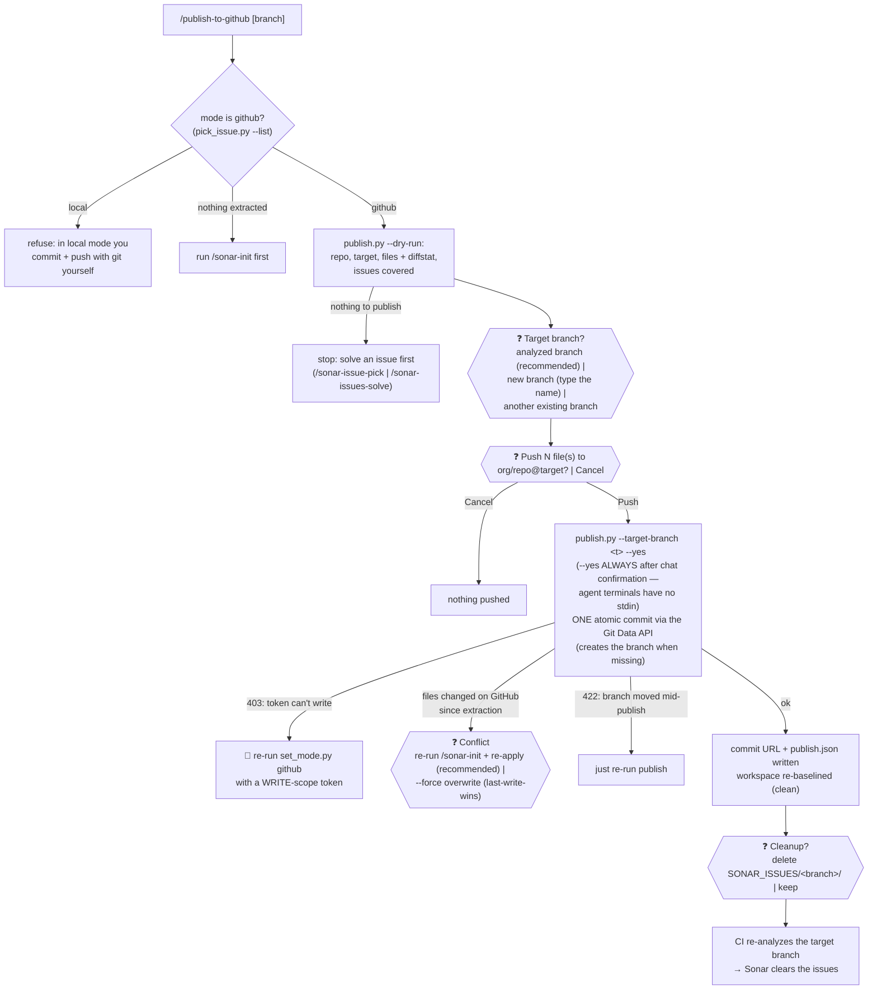

# FLOWS — what the AI will ask you, and what happens for each choice

Every decision below is presented by the AI as a **dropdown** (Claude Code) or a
**numbered menu** (Copilot chat). The recommended option is always listed first and
marked — it comes pre-computed from the scripts, so you can just press Enter on it.
Every skill also announces its phases as it goes ("issue 3/12"), so you always know
where the session is.

## The whole journey — every question you'll be asked

One diagram, use-case level: the **Local | GitHub** fork decides everything downstream.
`{{❓}}` hexagons are dropdowns; 🔐 is a hidden prompt in YOUR terminal (the AI never
sees the token). Notice what is NOT here anymore: no branch question at setup, and no
test runs during solving — `/sonar-verify` is its own step you invoke when ready.



## The big picture



## /sonar-init — extract (one dropdown, once)



## /sonar-issues-solve — solve everything (no test runs — that's /sonar-verify)



## /sonar-issue-pick — solve one issue



## /sonar-verify — run the tests (always YOU invoke it, never automatic)



## /publish-to-github — push GitHub-mode fixes (GitHub mode only)



## Worked example — local mode (interactive, Claude Code)

```text
You:  /sonar-issue-pick 003_S2095_ReportService.java_L26 --branch TASK-3487

AI:  🔴 BLOCKER S2095 — ReportService.java:26
     "Use try-with-resources or close this 'FileInputStream'..."
     mode: local
     recommend: sonar — the rule's compliant example matches this file's language
     ai effort: normal (Sonar estimates 10min)

     ❓ Fix approach?          → [Apply the Sonar suggestion (Recommended)]
                                 [Let AI solve it]  [Your own fix / notes]
You:  Apply the Sonar suggestion

AI:  (rewrites lines 26–31 as try-with-resources)
     $ git diff --stat -- src/main/java/.../ReportService.java
       1 file changed, 4 insertions(+), 2 deletions(-)     ← the fix landed
     resolution.json written (fixed).
     The fix is applied but untested — run /sonar-verify when you're ready.
     Sonar link: https://sonar.../project/issues?...&open=AY8x...

You:  /sonar-verify

AI:  [verify] auto-detected maven: mvn -B test
     [verify] PASSED ✅ — testsRun recorded; cleanup is now safe
```

## Worked example — GitHub mode (ends in publish)

```text
You:  /sonar-issue-pick 3 --branch TASK-3487

AI:  🔴 BLOCKER S2095 — ReportService.java:26
     mode: github
     workspace: not fetched yet — run: python .../workspace.py fetch src/main/java/.../ReportService.java

     ❓ Fix approach?          → [Apply the Sonar suggestion (Recommended)] ...
You:  Apply the Sonar suggestion

AI:  (workspace.py fetch → edits the WORKSPACE copy → workspace.py diff)
     [workspace] changes.patch rebuilt — 1 file(s) changed
     resolution.json written (fixed). Your checkout is untouched — `git diff`
     shows nothing by design; the fix lives in the workspace until
     /publish-to-github pushes it. Tests run in CI on the pushed branch.

You:  /publish-to-github

AI:  repo          : acme/report-service
     target branch : TASK-3487
     files to push : 1
       src/main/java/.../ReportService.java  +4 -2
     issues covered: 1
     ❓ Target branch?          → [TASK-3487 (Recommended)]  [a new branch]  [another existing]
     ❓ Push 1 file(s) to acme/report-service@TASK-3487?  → [Push]  [Cancel]
You:  Push

AI:  [publish] pushed 1 file(s) to TASK-3487 — commit 9f3ab12c04
     Sonar clears the issues after CI re-analyzes that branch.
     ❓ Cleanup? → [delete SONAR_ISSUES/TASK-3487/]  [keep]
```

Every choice above maps 1-to-1 to a box in the diagrams — if you're ever unsure what a
menu will do, find its ❓ box and follow the arrow.
